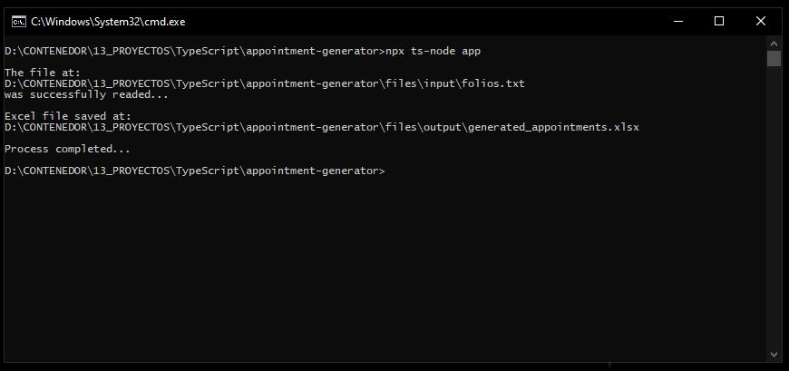

# Generador de citas

<br><br><br>

## Descripción

Esta herramienta genera citas aleatorias asignando fechas y turnos (Matutino/Vespertino) a una lista de folios proporcionada. Es útil para simular agendas o programaciones en aplicaciones de gestión de citas.

## Características

- **Generación de Fechas Aleatorias:** Asigna fechas aleatorias entre 3 y 10 días a partir de la fecha de ejecución y establece un limite de 10 citas por cada fecha.
- **Asignación de Turnos:** Asigna aleatoriamente turnos "Matutino" o "Vespertino" a cada cita.
- **Lectura y Escritura de Archivos:** Lee una lista de folios desde un archivo de texto y genera un archivo Excel con las citas asignadas.

## Instalación

1. **Clonar el repositorio:**
   ```bash
   git clone https://github.com/samoel-andres/appointment-generator.git
   cd appointment-generator
   ```
2. **Instala las dependencias:**
   Asegurate de tener Node.js instalado. Luego, ejecuta:
  ```bash
  npm install
  ```
   
## Uso
1. **Preparal el archivo de entrada:**
   Crea un archivo de texto llamado `input.txt` en el directorio `/files/input/`. Este archivo debe contener una lista de folios, cada uno en una línea separada.

2. **Ejecutar la aplicación:**
   ```bash
   npx ts-node app
   ```
   Esto generará un archivo `generated_appointments.xlsx` en el directorio `/files/output/` con las citas asignadas.

## Estructura del proyecto
- `app.ts`: Punto de entrada de la aplicación.
- `utils/`: Contiene funciones auxiliares para la generación de fechas y turnos.
- `data/`: Directorio para archivos de entrada y salida.

## Ejemplo de uso

### 1. Ejecución de la aplicación:
Despues de ejecutar el comando `npx ts-node app`, deberías ver la siguiente salida en la consola:



### 2. Archivo de entrada (`input.txt`):
El archivo `input.txt` debe contener una lista de folios, uno por línea:
| 120463501 |
|-----------|
| 120404844 |
| 120464924 |
| 120464133 |
| 120464950 |

### 3. Resultado generado (`generated_appointments.xlsx`):
El archivo de salida `generated_appointments.xlsx` contiene las citas generadas, con un formato similar a:
| Folio      | Cita        | Horario  |
|------------|-------------|----------|
| 120463501  | 19/02/2025  | Matutino |
| 120404844  | 22/02/2025  | Vespertino |
| 120464924  | 20/02/2025  | Matutino |
| 120464133  | 22/02/2025  | Vespertino |
| 120464950  | 22/02/2025  | Matutino |
